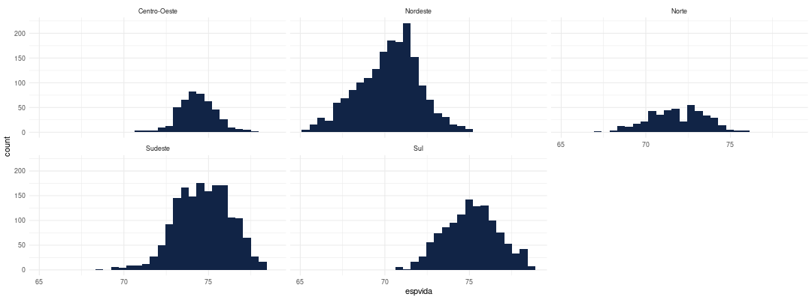

```{r setup, include=FALSE}
knitr::opts_chunk$set(
	echo = TRUE,
	message = FALSE,
	warning = FALSE
)
```

-   Anote suas dificuldades e dúvidas para que possamos conversar na próxima aula!

-   Nas aulas passadas, alguns exercícios foram pulados e estão neste script para que possamos praticar.

## Tópico 1 - R Base

No código a seguir, criamos um vetor de alturas, chamado `valores_alturas`, que contém 100 valores aleatórios, com reposição, de valores entre 1.50 à 1.90. A ideia é simular a altura de 100 pessoas para fazer o exercício :) (sim, sabemos que tem pessoas que estão fora dessa faixa de altura, mas escolhi esse intervalo por ser mais comum).

```{r}
alturas_possiveis <- 150:190/100
alturas_possiveis

valores_alturas <- sample(alturas_possiveis, # valores possiveis para sorteio
                          size = 100, # quantos valores quero "sortear"
                          replace = TRUE) # esses valores podem ser repetidos

valores_alturas 
```

1.  Usando as funções aprendidas hoje, verifique se a classe deste vetor é `numeric`:

```{r}

```

2.  Imagine que uma nova pessoa entrou no grupo, mas ela não se sentiu confortável em falar qual é a altura dela! Não sabemos qual é a altura dela, então tentem adicionar essa altura no vetor também. Lembre-se que podemos usar a função c() para combinar elementos!

```{r}

```

3.  Usando funções do R, verifique quantos valores temos nesse vetor.

```{r}

```

4.  Calcule a média da altura das pessoas do grupo. A função `mean()` calcula a média.

```{r}

```

5.  Quais são as alturas máximas e mínimas do grupo? Use as funções `min()` e `max()` para encontrar esse valores.

```{r}

```

6.  Qual é a mediana desse conjunto de valores? Use a função `median()` para calcular.

```{r}

```

7.  Calcule a variância e o desvio padrão deste conjunto de valores usando as funções `var()` e `sd()`.

```{r}

```

## Tópico 2 - Importação

Primeiro, precisamos carregar o pacote tidyverse, que será usado ao longo do script:

```{r}
library(tidyverse)
```

Precisamos carregar as bases também:

```{r}
dados_pnud <- read_csv2("dados/base_pnud_min.csv")
dicionario_pnud <- read_csv2("dados/dicionario_base_pnud_min.csv")
```

1)  Explore a base do dicionário do pnud. Quantas colunas tem? Quantas linhas tem? Quais informações essa pequena base apresenta? Busque usar funções em R.

```{r}

```

2)  Use a função unique() para criar um vetor com as siglas dos estados do Brasil.

```{r}

```

Exercícios: final da aula

-   Vamos usar os dados para o ano de 2010. Para isso é necessário filtrar os dados, e vamos ver como fazer isso no próximo tópico!

```{r}
dados_pnud_2010 <-  filter(dados_pnud, ano == 2010)
```

a)  Qual era a soma da população do Brasil em 2010?

```{r}
# Soma de população em 2010: 

```

b)  Qual era a média da expectativa de vida da população do Brasil em 2010?

```{r}
# média: expectativa de vida

```

Arredonde o valor encontrado nesse exercício, para apresentar 1 casa decimal:

```{r}
# arredondando para ter uma casa decimal

```

c)  Qual era a mediana da expectativa de vida da população do Brasil em 2010?

```{r}
# mediana: expectativa de vida

```

d)  Qual era a variância da expectativa de vida da população do Brasil em 2010?

```{r}
# variância: expectativa de vida

```

e)  Qual era o desvio padrão da expectativa de vida da população do Brasil em 2010?

```{r}
# desvio padrão: expectativa de vida

```

f)  Qual foi o maior valor encontado em um estado para a expectativa de vida da população do Brasil em 2010?

```{r}
# maior valor encontrado

```

g)  Qual foi o menor valor encontado em um estado para a expectativa de vida da população do Brasil em 2010?

```{r}
# menor valor encontrado

```

## Tópico 3 - Manipulação

Esse tópico será abordado na aula seguinte, mas o objetivo deste exercício é já ir se acostumando com o conteúdo! A ideia é que vocês interpretem os códigos a seguir (olhando o código e o resultado), e tentem explicar o que acham que aconteceu.

Para ajudar, segue um resumo de algumas funções útes:

- `select()`: seleciona colunas da base de dados
- `filter()`: filtra linhas da base de dados
- `arrange()`: reordena as linhas da base de dados
- `mutate()`: cria novas colunas da base de dados (ou atualiza as colunas existentes)
- `group_by()` + `summarise()`: agrupa e sumariza da base de dados
- `count()`: faz uma contagem por grupos

Já vimos que podemos filtar os dados da seguinte forma: no exemplo a seguir buscamos as linhas onde o ano seja igual à 2010.

```{r}
filter(dados_pnud, ano == 2010)
```

Podemos reescrever esse código desta forma, usando o pipe, que é usado para criar sequências de códigos:

```{r}
dados_pnud |> 
  filter(ano == 2010)
```

Vamos ver o pipe em outro exemplo! O que você acha que a função abaixo fez? Execute e veja o resultado. Pode escrever com as suas palavras :)

SUA INTERPRETAÇÃO: ...
```{r}
dados_pnud_2010 |> 
  count(uf_sigla)
```


SUA INTERPRETAÇÃO: ...
```{r}
dados_pnud_2010 |> 
  count(regiao_nm)
```


SUA INTERPRETAÇÃO: ...
```{r}
dados_pnud_2010 |> 
  count(regiao_nm) |> 
  arrange(n)
```
SUA INTERPRETAÇÃO: ...

```{r}
dados_pnud_2010 |> 
  select(muni_nm, uf_sigla, pop)
```

SUA INTERPRETAÇÃO: ...
```{r}
dados_pnud_2010 |> 
  select(muni_nm, uf_sigla, pop) |> 
  filter(pop > 1000000)
```

SUA INTERPRETAÇÃO: ...
```{r}
dados_pnud_2010 |> 
  select(muni_nm, uf_sigla, pop) |> 
  filter(pop > 1000000) |> 
  arrange(desc(pop))
```

SUA INTERPRETAÇÃO: ...
```{r}
dados_pnud_2010 |> 
  select(muni_nm, uf_sigla, pop) |> 
  filter(pop > 1000000) |> 
  arrange(desc(pop)) |> 
  mutate(pop_milhoes = pop/1000000)
```

SUA INTERPRETAÇÃO: ...
```{r}
dados_pnud_2010 |> 
  select(muni_nm, uf_sigla, pop) |> 
  filter(pop > 1000000) |> 
  arrange(desc(pop)) |> 
  mutate(pop_milhoes = round(pop/1000000, 2))
```


# Tópico 4 - Gráficos

Esse tópico será apenas uma pincelada, pois não temos tempo para abordar com mais detalhes. No R, criamos gráficos usando código! Experimente usar a seguinte função: `esquisse::esquisser()`

```{r eval=FALSE, include=FALSE}
esquisse::esquisser()
```

Explore o esquisse, e depois tente gerar um gráfico similar ao gráfico a seguir: 


Os dados usados foram `dados_pnud_2010`. O tipo de gráfico gerado é um histograma, e usamos as variáveis referentes à expectativa de vida (`espvida`) e a região do Brasil (`regiao_nm`). 

Dica: Adicionamos essas informações nos eixos X e no Facet (você vai descobrir o que é quando abrir o esquisse!).

O esquisse permite que você copie e cole o código do gráfico!

A vignette do esquisse pode ajudar também:
<https://cran.r-project.org/web/packages/esquisse/vignettes/get-started.html>

Adicione o código do gráfico a seguir:

```{r}

```

